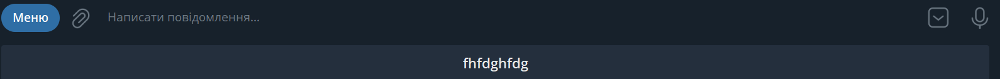
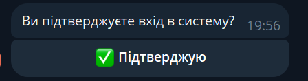

# Telegram bot with interface

------------
###### Українська
------------
#  Telegram bot with interface
##  Опис

Інтерфейс з керування телеграм-ботом. Через інтерфейс можна налаштувати меню для бота та автоматичні відповіді бота на текст, який пишуть користувачі боту. Для того, щоб інтерфейс працював коректно необхідно:
1. Сервер Apache2
2. Увімкнений мод Apache2 rewrite
```shell
sudo a2enmod rewrite
sudo systemctl restart apache
```
3. Composer
4. PHP 8.1

Для роботи проекту було використано неофіційну бібліотеку [telegram-bot-sdk](https://github.com/irazasyed/telegram-bot-sdk "telegram-bot-sdk"),
[Документація бібліотеки](https://telegram-bot-sdk.readme.io/docs "Документація бібліотеки"), тому після завантаження проекту обов'язково скористайтесь командою
```shell
composer install
```

##  Встановлення

1. Спочатку створіть бота. Зробити це можна в телеграмі написавши [BotFather](https://t.me/BotFather "BotFather"). Після всіх кроків для реєстрації бота отримаєте токен бота, який необхідно буде вказати в налаштуваннях конфігурації проекта.
2. Завантажте проект в необхідне місце, наприклад:
```shell
git clone https://github.com/imaydaydl/telegram-bot-interface.git /var/www
```
де /var/www - це папка куди буде завантажено проект
3. Якщо ще не увімкнули мод rewrite для Apache2:
```shell
sudo a2enmod rewrite
sudo systemctl restart apache
```
4. Встановлюємо бібіліотеку [telegram-bot-sdk](https://github.com/irazasyed/telegram-bot-sdk "telegram-bot-sdk")
```shell
composer install
```
5. Створюємо Базу даних. Залишаємо пустою. Все що необхідно для проекту буде встановлено автоматично при першому запуску.
5. Переходимо на свій домен https://my-domain.com/. Важливо, щоб домен працював із протоколом https. Цього потребує саме телеграм.
6. При першому переході автоматично відкриється інсталятор https://my-domain.com/install. Тут необхідно буде заповнити поля для конфігурації та БД.
6.1. Для конфігурації:
* Телеграм Bot token (можна заповнити пізніше)
* Посилання на Телеграм Bot (можна заповнити пізніше)
* Хеш (Обов'язковий до заповнення одразу. Може мати будь-яке значення. Можна скористатись кнопкою "Рандом". Використовується для паролей та хеш даних)
Після цього обов'язково натискаємо кнопку "Створити файл конфігурації"
6.2. Для БД:
* Сервер БД (Обов'язковий до заповнення)
* Назва БД (Обов'язковий до заповнення)
* Користувач БД (Обов'язковий до заповнення)
* Пароль користувача БД (Обов'язкове до заповнення, якщо у користувача встановлено пароль для підключення до БД, якщо пароля немає - можна залишити пустим. В любому випадку буде перевірка підключення до БД одразу.)
* Користувач (адмін) (Обов'язкове до заповнення. Початковий логін, за яким будете входити до інтерфейсу. Пізніше можна буде змінити)
* Пароль користувача (Обов'язкове до заповнення)
Після цього обов'язково натискаємо кнопку "Створити файл БД"
Також тут є кнопка "Підключити вебхуки до бота". Для того, щоб бот передав на сайт те, що натиснув, або написав клієнт необхідно підключити вебхуки до бота. Ця кнопка працює, якщо вказали токен бота та створили файл конфігурації. Натискати на наї необхідно до створення файла БД. Якщо пропустили пізніше можна натиснути цю кнопку в налаштуваннях.
7. Якщо все створено коректно, то відбудеться редірект на сторінку вводу логіна та пароля. Встановлення завершено.

##  Інтерфейс
Інтерфейс має світлу та темну теми.
**Повідомлення** - Після входу в інтерфейс першу сторінку, яку побачите це відправка повідомлень. Через цю сторінку можна відправляти всім, або окремому користувачеві повідомлення. Працюють MarkdownV2 теги для форматування тексту. Користувачі в списку будуть з'являтись, якщо вони написали боту після повного налаштування інтерфейсу.
**Історія повідомлень** - На цій сторінці можна переглянути всі повідомлення, які були відправлені з інтерфейсу.
**Лог бота** - На цій сторінці можна переглянути, що писав, або які кнопки натискав клієнт у бота.
**Користувачі** - Це список користувачів, які можуть користуватись інтерфейсом. Реєстрації в проекті не існує, тому додавати користувачів можна тільки через цю сторінку. При додаванні нового користувача заповнюється лише логін та пароль, а також доступи. Доступи це той функціонал, до якого новий користувач буде мати. Також можна відредагувати користувача та блокувати/розблокувати.
**Налаштування** - Розділ налаштуваннь конфігурації, підключення вебхуків, а також створення меню бота.
Щодо меню бота:
- Найперша кнопка завжди буде /start і вона йде обраною в першому селекторі. Взагалі селектор завжди буде мати опції з усіх створених кнопок для бота. Зауважу, що після створення бота команда /start завжди йде першою, тому рекомендую цю кнопку ніколи не видаляти і створити для неї дії.
- Поле для вводу тексту - тут вказується текст, який буде писати бот клієнту, якщо клієнт натиснув кнопку, що вказано в селекторі над цим полем.
- Кнопки глобального меню - це кнопки які будуть створені для меню, яке з'являється в телеграмі під вводом повідомлення
Як приклад

- Кнокпи до тексту - тут вказуються кнопки, які додаються до тексту повідомлення знизу. На відміну від глобальних ці кнопки мають 2 поля: одне полу це назва кнопки, яку будуть бачити клієнти, друге - дія. В дію можна вказати як посилання на сайт, так і якусь команду, наприклад, /join. А вже потім на /join підкріпити наступний крок.

ВАЖЛИВО! Не додавайте на кнопку меню і глобальні кнопки, і під текст. Телеграм зараховує в такому випадку тільки глобальні. Також в тексті кнопок та тексті повідомлення можна використовувати смайлики, але смайлики необхідно вставляти (копі-паст), не використовуйте їх тег.
- Додати окрему кнопку - Це додавання до меню кнопки, якої ще не було додано через глобальні, або під текст. Просто вказуєте, яка саме команда.
- Додати меню - Це додати наступний крок для меню бота.
- Після того як всі налаштування для меню зроблені ОБОВ'ЯЗКОВО натискаємо кнопку "Зберегти", інакше меню не буде збережено.
**Користувач** - Якщо натиснути на свій логін, що вказано зверху зправа, то відкриється сторінка профіль. Тут можна відредагувати свої дані (логін, ім'я, прізвище, пароль). Будь-які зміни в профілі мають супроводжуватись вказування старого пароля. Якщо в налаштуваннях конфігурації проекту увімкнули двухфакторну авторизацію, то в налаштуваннях профіля можна також увімкнути двухфакторну авторизацію, після чого з'явиться повідомлення, як саме увімкнути її. А саме потрібно вашому боту написати команду /authorize. Бот видасть хеш-код рандомно згенерований, який необхідно вказати при підключенні двухфакторної авторизації. Після цього кожного разу коли будете входити в проект під своїм логіном, потрібно буде через бота підтверджувати вхід.


На цьому все по функціоналу.
В планах: Вивести сандартні повідомлення для налаштування, додати англійську мову, порефакторити код.

------------
###### English
------------
# Telegram bot with interface
## Description

Telegram bot management interface. Through the interface, you can configure the menu for the bot and the bot's automatic responses to the text written by the bot's users. In order for the interface to work correctly, it is necessary:
1. Apache2 server
2. The Apache2 rewrite mod is enabled
```shell
sudo a2enmod rewrite
sudo systemctl restart apache
```
3. Composer
4. PHP 8.1

The project used the unofficial library [telegram-bot-sdk](https://github.com/irazasyed/telegram-bot-sdk "telegram-bot-sdk"),
[Library Documentation](https://telegram-bot-sdk.readme.io/docs "Library Documentation"), so after downloading the project be sure to use the command
```shell
composer install
```

## Installation

1. First, create a bot. You can do this by writing [BotFather](https://t.me/BotFather "BotFather") in Telegram. After all the steps to register the bot, you will receive a bot token, which will need to be specified in the project configuration settings.
2. Download the project to the required location, for example:
```shell
git clone https://github.com/imadaydl/telegram-bot-interface.git /var/www
```
where /var/www is the folder where the project will be downloaded
3. If you have not yet enabled the rewrite mod for Apache2:
```shell
sudo a2enmod rewrite
sudo systemctl restart apache
```
4. We install the library [telegram-bot-sdk](https://github.com/irazasyed/telegram-bot-sdk "telegram-bot-sdk")
```shell
composer install
```
5. We create a database. We leave it empty. Everything necessary for the project will be installed automatically at the first launch.
5. Go to your domain https://my-domain.com/. It is important that the domain works with the https protocol. This is precisely what Telegram needs.
6. The installer https://my-domain.com/install will automatically open on the first visit. Here you will need to fill in the configuration and database fields.
6.1. For configuration:
* Telegram Bot token (can be filled in later)
* Link to Telegram Bot (can be filled in later)
* Hash (Mandatory to fill in immediately. Can have any value. You can use the "Random" button. Used for passwords and data hash)
After that, be sure to click the "Create configuration file" button
6.2. For the database:
* DB server (Mandatory)
* Database name (Mandatory)
* Database user (Mandatory)
* Password of the database user (It is mandatory to fill in if the user has a password for connecting to the database, if there is no password - you can leave it blank. In any case, the connection to the database will be checked immediately.)
* User (admin) (Mandatory to fill in. The initial login you will use to enter the interface. You can change it later)
* User password (Mandatory)
After that, be sure to click the button "Create database file"
There is also a button "Connect webhooks to the bot". In order for the bot to transmit to the site what the client clicked or wrote, it is necessary to connect webhooks to the bot. This button works if you specify a bot token and create a configuration file. It is necessary to click on it before creating a database file. If you missed it later, you can press this button in the settings.
7. If everything is created correctly, you will be redirected to the login and password entry page. Installation is complete.

## Interface
The interface has light and dark themes.
**Messages** - After entering the interface, the first page you will see is sending messages. Through this page, you can send a message to everyone or to an individual user. MarkdownV2 tags for text formatting work. Users in the list will appear if they have written a bot after fully configuring the interface.
**Message History** - On this page you can view all messages that have been sent from the interface.
**Bot log** - On this page you can view what was written or what buttons the client pressed in the bot.
**Users** - This is a list of users who can use the interface. There is no registration in the project, so you can add users only through this page. When adding a new user, only the login and password, as well as accesses, are filled in. Access is the functionality that the new user will have. You can also edit the user and block/unblock.
**Settings** - Configuration settings section, connecting webhooks, as well as creating a bot menu.
Regarding the bot menu:
- The very first button will always be /start and it is selected in the first selector. In general, the selector will always have options from all buttons created for the bot. I note that after creating a bot, the /start command always goes first, so I recommend that you never delete this button and create actions for it.
- Field for entering text - here you specify the text that the bot will write to the client if the client clicks on the button specified in the selector above this field.
- Global menu buttons are buttons that will be created for the menu that appears in Telegram under the message input
As an example

- Buttons to the text - here are the buttons that are added to the text of the message from below. Unlike global buttons, these buttons have 2 fields: one field is the name of the button that clients will see, the second is the action. In the action, you can specify both a link to the site and some command, for example, /join. And then confirm the next step on /join.

IMPORTANTLY! Do not add global buttons to the menu button and under the text. In this case, Telegram counts only global ones. You can also use emoticons in button text and message text, but emoticons must be pasted (copy-paste), do not use their tag.
- Add a separate button - This is the addition to the menu of a button that has not yet been added via global buttons or under the text. Just indicate which team.
- Add Menu - This is to add the next step for the bot menu.
- After all settings for the menu have been made, you MUST press the "Save" button, otherwise the menu will not be saved.
**User** - If you click on your login, which is indicated on the top right, the profile page will open. Here you can edit your data (login, first name, last name, password). Any changes in the profile must be accompanied by the indication of the old password. If two-factor authentication is enabled in the project configuration settings, then two-factor authentication can also be enabled in the profile settings, after which a message will appear on how to enable it. Namely, your bot needs to write the /authorize command. The bot will issue a randomly generated hash code, which must be specified when connecting to two-factor authentication. After that, every time you enter the project under your login, you will need to confirm the entry through the bot.


This is all about functionality.
TODO: To display standard messages for configuration, add English language, refactor the code.